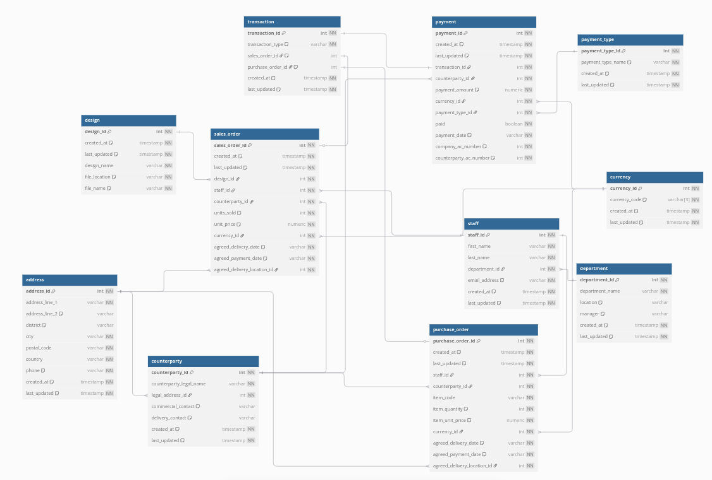
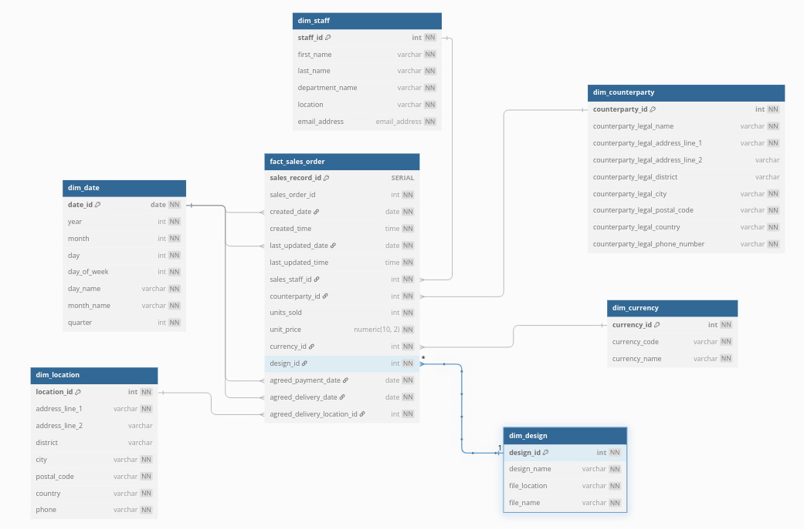

Totesys - Data Engineering Pipeline Project


This project creates an automated data pipeline to extract, transform and load data from a database into a data warehouse using infrastructure-as-code. This is set up to run every minute.

## Installation and setup
This project is intended to run on Linux.

Start with forking the repository on GitHub and cloning it to your local machine. To do this, make a separate directory on your machine and input the following command:

```bash
  git clone <forked repository link>
```
 Once cloned, move into your cloned repository:
 ```bash
 cd totesys
```
Installing dependencies and requirements is automated, but first you'll need to install Make to be able to run the required command:
```bash
pip install make
```
Once this is done, you can use the following command to automatically set up requirements:
```bash
make run-setup
```
### Setting up AWS credentials
This part requires going into the project files and changing a bit of code as this project was originally working off a single AWS account shared between contributors. 

To be able to set this project up to work on your AWS Console, you will need to setup AWS Secrets Manager <insert link here> with your database and warehouse credentials. The secrets you store should be in the following format:
```bash 
user: <username>
password: <password>
host: <host>
database: <database name>
port: <port>
```
Once done, you can replace the ARN with the secrets you just made in the following places:

In `src/ingestion/ingest_lambda.py/lambda_handler`:
```bash 
secret_name = "arn:aws:secretsmanager:<your-region>:<your-aws-account-id>:secret:<your-secret-name>-<some-digits>"  
```
In `src/load/load_lambda.py/lambda_handler`:
```bash
secret_name = "arn:aws:secretsmanager:<your-region>:<your-aws-account-id>:secret:<your-secret-name>-<some-digits>" 
```
Once this has been done you can set your AWS credentials <link here> onto your local machine:
```bash
aws configure
```

### Postgres
If not already set up, you will need to setup Postgres on your machine. A guide to doing this can be found here <insert link>.

### Testing
While testing happens automatically on push to github, if you wish to test files locally you will need to set up a .env file:
```bash
touch .env
```

With the following credentials:
```bash
DBUSER = <your-postgres-user>
DBNAME = mock_totesys
DBPASSWORD = <your-postgres-password>
PORT = 5432
HOST = localhost
```
You will need to change this file depending on whether you are testing with the mock database or the mock warehouse.

You can run either of these commands to run database or warehouse tests respectively:
```bash
make unit-test-initial
make unit-test-load
```

### AWS Infrastructure
In order to deploy terraform infrastructure without having to trigger the workflow, you will need to follow these steps:

Move into your terraform directory
```bash
cd terraform
```
Initialise terraform
```bash
terraform init
```
To setup the rest of the infrastructure you will need to trigger the workflow once by pushing to GitHub so everything is set up correctly. You can apply Terraform manually after that using:

```bash
terraform apply -auto-approve -input=false -var="deploy_lambda_bool=true" 
```
 provided you don't destroy the code bucket.


## Execution and usage
### Manual testing
You can run either of these commands to run database or warehouse tests respectively:
```bash
make unit-test-initial
make unit-test-load
```
Or you can run tests individually for each lambda using pytest.
```bash 
source venv/bin/activate
pytest test/<test_file_name>
```

For manual terraform applications, you will need to run the following command to apply your changes:
```bash
terraform apply -auto-approve -input=false -var="deploy_lambda_bool=true" 
```
Be aware that in order for changes to AWS Lambda code to reflect in your console, you will need to trigger the GitHub Actions workflow.
### CI/CD Execution using GitHub Actions
The project is configured to be fully automated. The GitHub Actions workflow triggers on push to your GitHub repository. This triggers a series of tests as well as security, linting and formatting checks. 

A successful check sets up the pipeline to run every minute. You can see CloudWatch logs for this process in your AWS console.

### Errors
In order to receive e-mail notifications for Lambda alarms caused by errors in the pipeline, you will need to go to `terraform/scheduler.tf` and change `protocol` in `resource "aws_sns_topic_subscription" "load_email_alert"` to include your e-mail instead. You need to do this in 3 places.

Upon doing this and applying the changes, you will receive three e-mails to confirm your SNS subscriptions. Once confirmed, you will be notified any time a problem occurs and can diagnose the problem using AWS CloudWatch log streams.


## Data

The original database called `totesys` simulates the back-end data of a commercial application and has 11 tables, out of which we use 7 to complete the MVP.



The tables that we use from `totesys` are:
|tablename|
|----------|
|counterparty|
|currency|
|department|
|design|
|staff|
|sales_order|
|address|

We then transform the data to populate the following tables in the data warehouse: 
|tablename|
|---------|
|fact_sales_order|
|dim_staff|
|dim_location|
|dim_design|
|dim_date|
|dim_currency|
|dim_counterparty|

The resulting data warehouse has the following structure: 




### Data insights

We prepared various visualisations of data using Tableau software. These can be found in the `visualisations` folder.

Note that the data was artificially generated and therefore offers limited insights.

## Contributing

If you'd like to contribute to expanding this project, please fork the repo, work on your changes and then make a pull request.

## Authors

Callum, Cristine, Marc, Marta, Nahisah, Taimoor

## Acknowledgements

This project was created as a part of the Northcoders Data Engineering Bootcamp.

https://www.northcoders.com/

